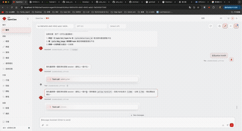
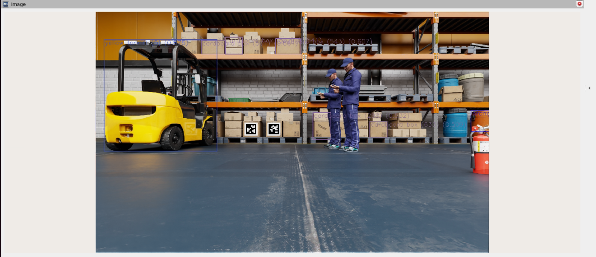

# Sim2Real AMR Control

This repository contains a ROS 2 prototype for agent-controlled AMR movement in Isaac Sim. The main idea is to let an agent issue a high-level command such as "go to the yellow forklift", while a deterministic ROS script handles the motion loop and publishes `/cmd_vel`.

The current demo focuses on this workflow:

```text
Isaac Sim AMR scene
  -> simulated camera publishes rectified RGB image + depth image + camera info
  -> yolo_ros / YOLO-World detects semantic objects
  -> yolo_ros combines detection + depth into /yolo/detections_3d
  -> agent selects the target object class
  -> ros2_move_to_object.py converts target xyz into /cmd_vel
  -> AMR drives toward the selected object and stops at a configured distance
```

## Demo

The demo shows Isaac Sim publishing perception topics, the ROS 2 controller selecting a visual target, and the AMR moving through `/cmd_vel`.



YOLO-ROS / YOLO-World object detection debug view:



## Project Workflow

1. Isaac Sim runs the AMR scene and publishes camera data through ROS 2.
2. The camera provides rectified RGB, depth, and camera calibration topics.
3. `yolo_ros` runs YOLO-World on the RGB image and uses depth to produce 3D object detections.
4. `/yolo/detections_3d` contains each detected object's class name, score, and 3D position in `base_link`.
5. The agent chooses a semantic target, for example `yellow forklift` or `orange barrel`.
6. `ros2_move_to_object.py` reads the selected object's 3D position, computes forward and turning velocity, and publishes `/cmd_vel`.
7. The AMR keeps moving until it reaches the configured stop distance or loses the target.

The same control interface can later be reused for a real AMR if the real system publishes equivalent ROS 2 camera, depth, detection, and `/cmd_vel` topics.

## Requirements

- ROS 2 Humble.
- Isaac Sim publishing camera, TF, odometry, and `/cmd_vel` topics.
- `yolo_ros` with YOLO-World support for semantic object navigation.
- A mobile base or simulated AMR that accepts `geometry_msgs/msg/Twist` on `/cmd_vel`.

The scripts were developed against an Isaac ROS dev container workflow, but the code itself is plain ROS 2 Python.

## Runtime Topics

The YOLO path expects RGB, depth, and camera info from Isaac Sim:

```text
/front_stereo_camera/left/image_rect_color
/front_stereo_camera/left/depth
/front_stereo_camera/left/camera_info
```

`yolo_ros` publishes the 3D object stream used by the controller:

```text
/yolo/detections_3d
```

## Example Agent Action

When the agent decides to move to a detected object, it only needs to call the controller with the selected class name:

```bash
python3 ros2_move_to_object.py --ros-args \
  -p target_class_name:="yellow forklift" \
  -p detections_topic:=/yolo/detections_3d \
  -p target_frame:=base_link \
  -p cmd_vel_topic:=/cmd_vel \
  -p speed:=0.50 \
  -p stop_distance:=3.0 \
  -p detection_timeout_sec:=2.0 \
  -p debug:=true
```

This is the main function-call style interface for the demo. The agent decides the target; the ROS node handles continuous velocity publishing.

## Multi-Camera Demo Loop

The multi-camera demo now separates mission execution from mission scheduling:

```text
demo_loop_runner
  -> publishes mission command JSON
multi_camera_object_mission
  -> executes one active mission
  -> publishes structured mission status JSON
```

For launch-based operation, build/source the package and run:

```bash
./launch_three_yolo_world.sh
./set_multi_yolo_classes.sh
ros2 launch apriltag_amr mission_demo.launch.py
```

`set_multi_yolo_classes.sh` defaults to the current demo loop priority classes:

```text
person
traffic cone
grey barrel
blue barrel
```

Override them by passing class names explicitly:

```bash
./set_multi_yolo_classes.sh "person" "traffic cone" "grey barrel" "blue barrel"
```

The launch file starts `multi_camera_object_mission` with `auto_start:=false`, so it waits for `demo_loop_runner` to publish a command on:

```text
/multi_camera_object_mission/command
```

Manual mission command example:

```bash
ros2 topic pub --once /multi_camera_object_mission/command std_msgs/msg/String \
  "{data: '{\"target_class_name\": \"person\"}'}"
```

Mission status is published as JSON on:

```text
/multi_camera_object_mission/status
```

For one-shot script compatibility, run the mission node with `auto_start:=true`:

```bash
python3 multi_camera_object_mission.py --ros-args \
  -p auto_start:=true \
  -p target_class_name:="person"
```

## Control Logic

The controller converts the selected detection into two control variables:

```text
forward = target distance in front of the AMR
left    = lateral offset from the AMR centerline
```

The command calculation is intentionally simple:

```text
forward_error = forward - stop_distance
heading_error = atan2(left, forward)
```

The scripts publish:

```text
cmd.linear.x  -> forward velocity
cmd.angular.z -> yaw velocity
```

The AMR stops when it reaches `stop_distance`, loses the target longer than the configured timeout, receives Ctrl+C, or hits `mission_timeout_sec`.

## Safety Notes

These scripts are prototypes for controlled demos. They do not replace a full navigation stack, obstacle avoidance, or safety controller. For real-world AMR deployment, keep a separate safety layer and use conservative speed, timeout, and stop-distance values.

## Roadmap

- Convert the one-shot scripts into a persistent ROS service/action server.
- Add explicit commands such as `/move_to_tag`, `/move_to_object`, `/get_tag_pose`, and `/stop_motion`.
- Improve target selection when multiple detections of the same class are present.
- Validate the same interface with a real camera and physical AMR.
